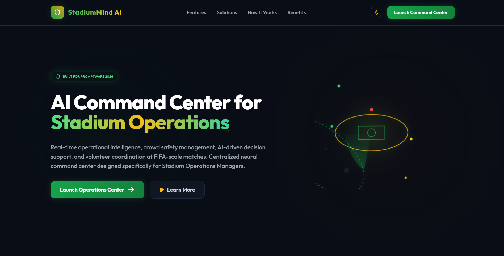
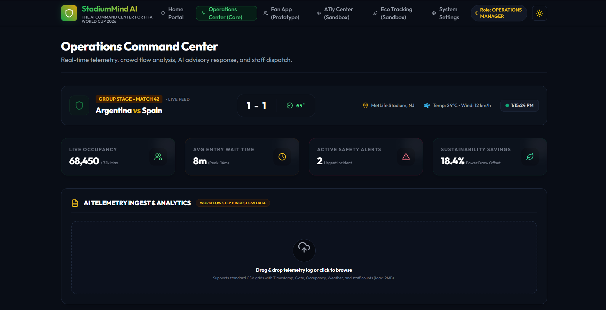
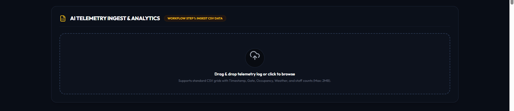
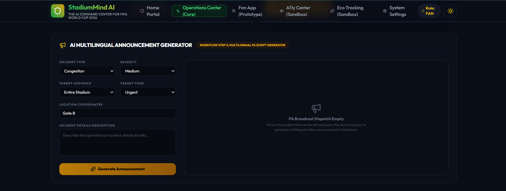

# StadiumMind AI

> **The Explainable AI Command Center for FIFA World Cup 2026**
> An AI-powered Tournament Operations Copilot built for the Google PromptWars Hackathon.

[](https://www.typescriptlang.org/)
[](https://react.dev/)
[](https://expressjs.com/)
[](https://deepmind.google/technologies/gemini/)
[](https://vite.dev/)
[](https://nodejs.org/)

---

## Live Demo

- **Frontend:** https://promptwars-h2s.vercel.app
- **Backend Health:** https://stadiummind-backend.onrender.com/api/status
---

## Challenge Vertical & Persona

**Challenge Vertical:** Smart Stadiums & Tournament Operations

**Target Users:** Stadium Operations Managers, Security Chiefs, Tournament Organizers

StadiumMind AI was designed to support decision-makers responsible for managing large-scale sporting events where crowd safety, emergency coordination, multilingual communication, and operational efficiency are critical.

## Problem Statement

Coordinating stadium logistics at a FIFA-scale event involves navigating high-pressure, multi-dimensional challenges:
- **Crowd Congestion & Bottlenecks**: Rapid spikes in spectator arrivals from regional shuttle networks generate severe queues at gate turnstiles and walkway corridors.
- **Emergency Incidents**: Medical emergencies, security alerts, and facility breakdowns must be resolved immediately to avoid crowd surges.
- **Volunteer Coordination**: Assigning volunteer stewards dynamically based on congestion patterns is highly complex.
- **Multilingual Communications**: Relaying safety instructions to international fans in their native languages is prone to translation delays.
- **Transportation Coordination**: Train and bus delays must propagate into gate entry adjustments.

### Why Traditional Dashboards Fail
Traditional monitoring dashboards display raw numbers (e.g. occupancy counts, latencies) but behave like passive databases. They lack the reasoning capability to correlate these indicators. Without AI assistance, managers must perform manual diagnostics under extreme stress, leading to cognitive overload and delayed emergency response times.

---

## Solution

StadiumMind AI acts as an AI operations copilot, bridging the gap between passive sensors and real-world coordination. By leveraging Google Gemini, it:
1. Translates live telemetry arrays into actionable safety assessments.
2. Explains the operational reasoning behind every recommendation.
3. Automates the generation of calm, safety-focused multilingual PA scripts.
4. Generates structured JSON reports for audit export compliance.

---

## Why Generative AI?

Rather than relying on simple hardcoded threshold rules, StadiumMind AI uses Google Gemini to perform multi-variable operational diagnostics:
- **Dynamic Reasoning**: Evaluates how weather warnings, volunteer levels, and transport delays compound gate occupancy metrics.
- **Explainable Justification**: Explicitly details *why* a particular redirection or steward dispatch is advised, rather than just issuing blind directives.
- **Multilingual PA Generation**: Generates calm, safety-focused stadium voice broadcasts under 80 words in English, Spanish, and French, avoiding alarmist words that could trigger panic.
- **Structured Data Enforcement**: Guarantees JSON outputs using Gemini MIME forcing, ensuring seamless frontend visualization without parsing errors.

## Prompt Engineering Strategy

StadiumMind AI uses carefully structured prompts to ensure consistent, explainable, and operationally useful responses.

- **Role Prompting:** Gemini is instructed to behave as a senior tournament operations advisor.
- **Structured Output:** Responses follow predefined JSON schemas to simplify frontend rendering and validation.
- **Explainable Responses:** Every recommendation includes clear reasoning instead of opaque AI outputs.
- **Controlled Announcements:** Emergency announcements are generated using calm, concise language suitable for large public gatherings.
- **Fallback Handling:** If telemetry is incomplete or inconsistent, the AI defaults to safe operational recommendations instead of making unsupported assumptions.

### Why Rule-Based Systems Fail
A rule-based system requires writing thousands of nested conditions (e.g., *if occupancy > 80% and volunteers < 5 and rain = true...*). Such systems fail when encountering complex, fuzzy matchday realities. Gemini handles these variables holistically, formulating context-aware suggestions in real time.

---

## Key Features

| Feature | Description |
| :--- | :--- |
| **AI Crowd Risk Analysis** | Evaluates occupancy, entry rates, weather, and incidents to determine risk status. |
| **Explainable AI Reasoning** | Displays reasoning cards prepended with explicit "Reason 1, 2, 3" badges. |
| **CSV Telemetry Ingest** | Uploads matchday spreadsheets parsed on the backend to avoid API token bloat. |
| **Operational Analytics** | Renders parsed stats summaries (Average Occupancy, Hotspots, Medical Logs). |
| **Multilingual PA Generator** | Generates PA scripts in English, Español, and Français matching targets. |
| **Audience & Tone Configuration** | Customizes scripts based on target teams (Security, Volunteers) and mood tones. |
| **Compliance Report Export** | Downloads generated AI responses directly as structured `.json` reports. |
| **Keyboard Accessibility** | Supports keydown triggers and full ARIA descriptions on drag-and-drop cards. |
| **Transient Error Containment** | Implements execution timeout racing and exponential backoff retries. |
| **Human-in-the-Loop Decision Making** | Operators review AI recommendations before actions are recorded. |

---

## System Architecture

```text
+-------------------------------------------------------------+
|                        Landing Page                         |
+-------------------------------------------------------------+
                              | (Launch)
                              v
+-------------------------------------------------------------+
|                 Operations Center Dashboard                 |
+-------------------------------------------------------------+
      | (Upload Telemetry)                 | (Incident Details)
      v                                    v
+-----------------------------+      +------------------------+
|   POST /api/ai/parse-csv    |      | POST /generate-ann...  |
+-----------------------------+      +------------------------+
      | (PapaParse Engine)                 | (Audience + Tone config)
      v                                    v
+-----------------------------+      +------------------------+
|   POST /api/ai/analyze-stats|      |      Google Gemini     |
+-----------------------------+      +------------------------+
      |                                    | (MIME application/json)
      +-----------------+------------------+
                        |
                        v
+-------------------------------------------------------------+
|                 Structured responseValidator                |
+-------------------------------------------------------------+
                        | (Verify schemas & UTC logs)
                        v
+-------------------------------------------------------------+
|                 Explainable Decision Panel                  |
|          [Checklists | Reasons | JSON Export | PA]          |
+-------------------------------------------------------------+
```

---

## Technology Stack

- **Frontend**: React (v18.3) SPA, Vite (v5.2), TypeScript, Vanilla CSS
- **Animations**: Framer Motion (v11.2)
- **Icons**: Lucide React
- **Backend**: Node.js, Express.js (v4.19), TypeScript
- **CSV Parser**: PapaParse (v5.4)
- **AI Integration**: Official `@google/genai` SDK
- **Model**: `gemini-3.1-flash-lite` (configured via env variables)

---
## AI Workflow

1. Upload telemetry or incident details.
2. Backend validates and processes the data.
3. Google Gemini analyzes the validated data and generates explainable recommendations.
4. Operators review AI suggestions.
5. Decisions are recorded for operational tracking.

## Practical Matchday Use Cases

### Crowd Congestion
The AI identifies congestion risks and recommends gate redirection before bottlenecks become unsafe.

### Weather Disruption
The AI evaluates weather alerts together with crowd density and recommends operational adjustments.

### Medical Emergency
The AI summarizes incident information and generates multilingual announcements to support rapid communication.

## Testing

The project includes automated tests for both frontend and backend.

Frontend:
- Vitest
- React Testing Library

Backend:
- Vitest
- Supertest

Run:

Frontend

```bash
cd frontend
npm test
```

Backend

```bash
cd backend
npm test
```

## Folder Structure

```text
promptwars-h2s/
├── backend/
│   ├── src/
│   │   ├── config/          # Gemini configuration and env variables validation
│   │   ├── controllers/     # Express route handlers (parsing, analytics controllers)
│   │   ├── middleware/      # Error handling middleware
│   │   ├── routes/          # Express route mounts (/status, /ai/*)
│   │   ├── services/        # Gemini API orchestration, prompt builder, validator
│   │   ├── shared/          # Centralized mock data payloads
│   │   └── types/           # Strong type definitions (ai.ts, index.ts)
│   └── tsconfig.json
├── frontend/
│   ├── src/
│   │   ├── components/
│   │   │   ├── ai/          # Reusable Explainable AI components
│   │   │   ├── landing/     # Landing page section layouts
│   │   │   └── operations/  # Operations Dashboard panels (upload card, decision card)
│   │   ├── context/         # App level state (theme, user roles)
│   │   ├── layouts/         # Master layouts (AppLayout)
│   │   ├── pages/           # Page routers (Operations Center, prototypes)
│   │   ├── services/        # Client API services (geminiService, apiClient)
│   │   └── types/           # Type declarations
│   └── vite.config.ts
└── README.md
```

---

## Screenshots

### Landing Page


### Operations Dashboard


### CSV Analytics & Ingest


### PA Announcement Generator


---
## Assumptions & Limitations

- Some endpoints intentionally use local simulations to ensure deterministic demonstrations during hackathon evaluation.
- Decision history is stored in memory and resets when the backend restarts.
- Live AI features require internet connectivity and a valid Gemini API key.

## Future Scope

StadiumMind AI is designed to scale into a unified tournament platform:
- **Volunteer Companion App**: A dedicated mobile companion assigning local tasks directly to stewards.
- **IoT Sensors Integration**: Ingesting live Bluetooth beacon and turnstile sensor streams.
- **CCTV Computer Vision**: Combining Gemini Multimodal models with live camera feeds for real-time crowd counting.
- **Evacuation Simulations**: Simulating dynamic evacuation path closures using generative reasoning.

---

## Contributors

- **Swarnim Kumar Sahu** - Lead System Architect & Prompt Engineer - [GitHub Profile](https://github.com/swarnim-sahu)

---