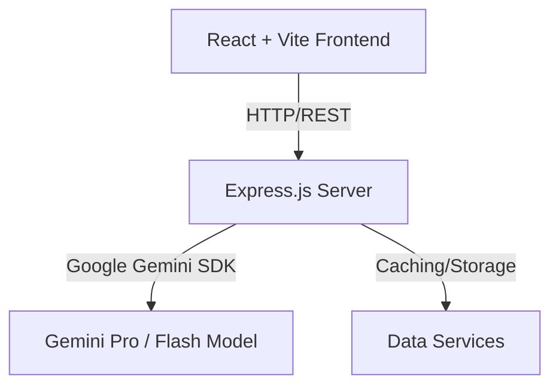

# StadiumMind AI - Architecture Overview

StadiumMind AI serves as the AI Command Center for the FIFA World Cup 2026. This document explains the high-level architecture.

## System Topology

## Key Modules
1. **Fan Dashboard**: Dynamic seat routing, public transit integration, multilingual chatbot.
2. **Operations Dashboard**: Real-time crowd heatmaps, bottleneck warnings, incident dispatch orchestration.
3. **Accessibility Center**: Accessible route planning, text-to-speech commentary, sign language overlay interface.
4. **Sustainability Tracker**: AI-guided recycling classifier, energy optimization recommendations.

## Tech Stack
- **Frontend**: React (v19), Vite, Tailwind CSS, TypeScript, React Router, Framer Motion, Lucide React.
- **Backend**: Node.js, Express.js, TypeScript.
- **AI Core**: Google Gemini API integration (prepared).
